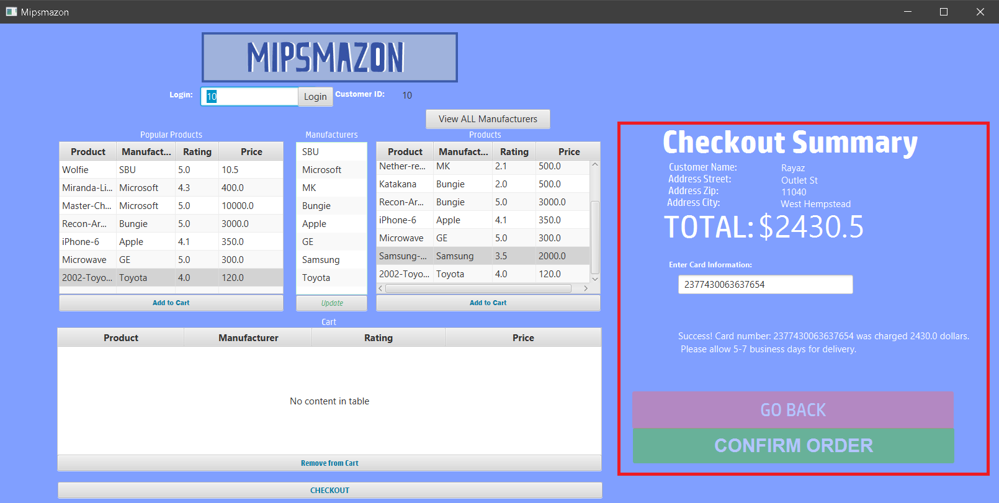

Mipsmazon is a fictional ecommerce program created by Mirza Radoncic, Shahzeel Farooqi, and myself. 
It was created for our CSE305 (Database Management) course. We used JDBC (Java Database Connector) to interact with a MySQL database that we created and hosted on our laptops,
with the user interacting with a JavaFX front end. The end product was a new an interesting take on ecommerce sites 

User adds items to their own unique cart. 
SQL database updates accordingly for each product that gets added to the cart

User checks out, inputs their card information and hits confirm order:
Likewise the customer order schema is updated in the database as the transaction completes

The original repository can be seen [here](https://github.com/mirzarad/Mipsmazon) .(Note: Because the database was hosted from his computer, all commits were pushed by Mirza).